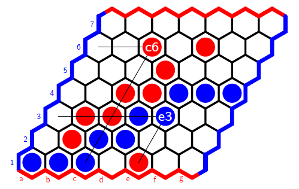

# Cachex-Game
AI agent  - Cachex board game

 </br>
(Example board above with winning connection for Blue)

## Brief intro to the game
Cachex is a perfect-information two-player game played on an n * n rhombic, hexagonally tiled
board, based on the strategy game Hex. Two players (named *Red* and *Blue*) compete, with the
goal to **form a connection between the opposing sides of the board corresponding to their respective color.**

Easy to play. Mechanisms only including:
1. Steal (swap)
2. Capture

Game details: [cachex game spec](AI_cachex_spec.pdf) </br>
Program details: [project spec](project_spec.pdf)

## Code structure
"referee": module for running the game and printing to console </br>
"pygame": module for one AI agent </br>
"pygame2": module for another AI agent (modified version of pygame module) 

## Run the code
Format: "python -m referee \<n> \<red module> \<blue module> -c" </br>
"-c" is optional, for the purpose of displaying colors
```
python -m referee 7 pygame pygame2 -c
```

## More info
This program can only perform AI vs AI. Here are tools/resources allowing more interactions:

Interactive Cachex tool: https://surya-ven.github.io/cachex/ (by Surya Venkatesh) </br>
AI vs Human tool: https://github.com/stefanmarbun12/Cachex-COMP30024 (by Stefan Armando Marbun)

